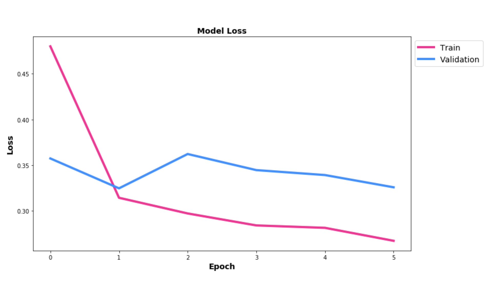
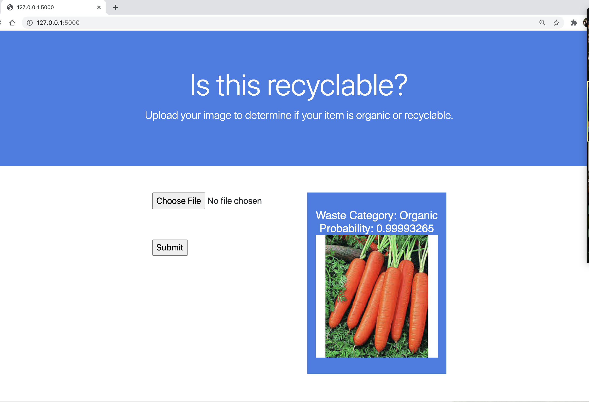

# Final Project: Machine Learning Waste Classification Model
### Project Members: Paresh Bansal, Utkarsh Verma, Rohan Agarwal, Preyansh Sharma
Background & Purpose
Recycling waste material is a huge challenge globally. This is because waste is not only challenging to sort at the human level, but it is also time consuming and often hazardous. One promising area of research and innovation that could be used to address this problem is machine learning and artificial intelligence. Using smart technology to classify waste could be a cost efficient, safe, and possibly even more accurate method of sorting large amounts of waste in a timely manner, which could thereby help to improve the recycling rate. The purpose of this project is to build a machine learning model that classifies images of materials and objects as being organic or recyclable.

The Data
The dataset we used is available on Kaggle and has over 22,5000 images and is divided into train data (85 %) and test data (15 %). The data are structured into two subfolders: "TEST" and "TRAIN", and within each, there are two more folders: "O" (for organic images) and "R" for recycled images.

Link to data: https://www.kaggle.com/techsash/waste-classification-data

Model Building and Evaluation
We built a convolutional neural network model using Keras and Tensorflow. The base model was pre-trained transfer learning model: VGG16 with ImageNet weights. To this, we added customized dense layers in addition to other features such as layer freezing and dropout. We set our model to train for 20 epochs and added an early stopping callback. The highest accuracy reached was .94. The overall accuracy for the model was .939 and the loss was .365. Matplotlib and Seaborn were used to plot the results of the training and evaluation, in addition to generating visualizations of the base model features and layers.

2-Accuracy

Front End Application
We built a front-end web application using Python Flask, which employs the following packages: flask, keras, numpy, tensorflow, and pillow. The web app allows users to upload a photo of their choice. We created two python scripts that renders the image from the uploading form and is then feeds it into our waste classification model. Specifically, we defined a function that calls the model prediction for each uploaded image, and we then linked these scripts to an html file to return a classification for the image: "Organic" or "Recyced", along with the probability score.

We followed this article's steps to set up our Flask App:
Link: https://medium.com/@arifulislam_ron/flask-web-application-to-classify-image-using-vgg16-d9c46f29c4cd
 
Author: Arif Ul Islam (Ron)

Conclusions
This is just a small step in applying machine learning to recylcing and waste sorting. In order to make a significant impact in waste sorting plants and on the recycling rate globally, much more sophisticated models, i.e., ones that can classify materials into multiple categories and sub-categories, would need to be developed so that waste could be efficiently and correctly sorted at a large scale level.

How to run this app locally:
Setup/Requirements:
Visual Studio Code (suggested)
Chrome browser recommended
Python (required)
See the dependencies, which may require installation
File Structure:
project (main project folder)
│   index.py
│   main.py 
│
└───Resources
│   │    
│   └───Model
│     	  final_model_weights.hdf5
│  
└───templates
│   	  index.html
│          
└───static (uploaded images will be stored here) -- must be named "static"
       
Note: Within the index.py and main.py files, you may need to change some file paths to match your system path structure. Within the main.py file, change the paths for line 14 and 15. Within the index.py file, change the paths for lines 14 and 41.

Steps:
Download files into the above file structure
Change file paths per above instructions
Open and run the index.py file in terminal
Once run, a web address will appear at the bottom of the terminal.
Open brower at "localhost:5000".
Select an image file using the "Choose File" button then click on "Submit".
This should return a classification and probability score.
Enjoy!
